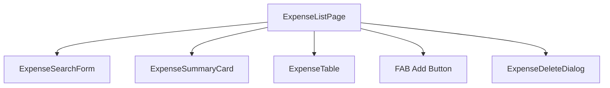
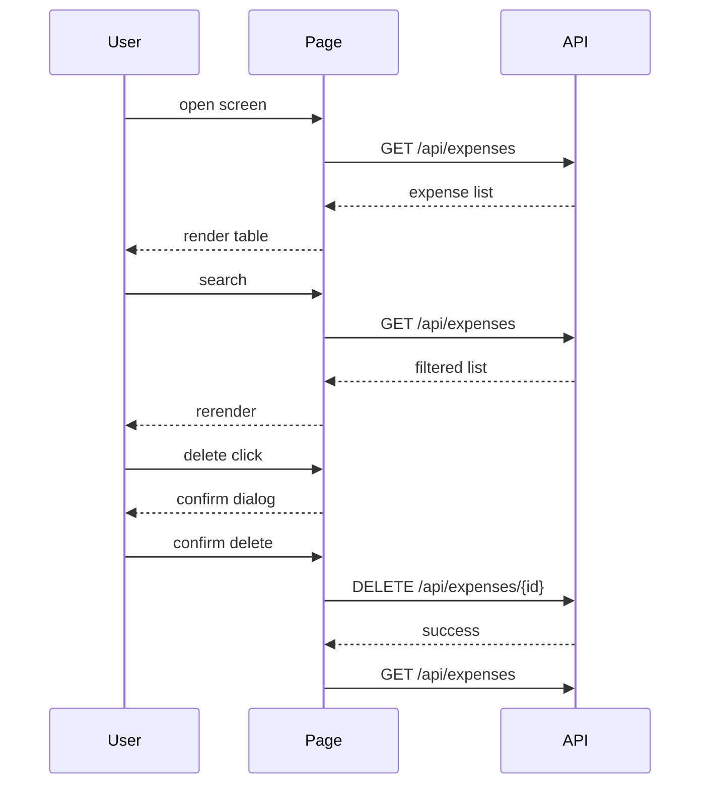

# Expense List Screen

## Responsibility

出費一覧を表示する。

以下を担当する:

- 出費一覧取得
- キーワード検索
- 月別フィルタ
- 出費削除
- 出費編集画面への遷移
- 出費登録画面への遷移

この画面では:
- 出費の登録処理は行わない
- グローバルstateは変更しない

---

# Route

| item | value |
|---|---|
| path | /expenses |
| auth | required |
| layout | MainLayout |

---

# Screen Layout



---

# UI Rules

- モバイルファースト
- FABは右下固定
- テーブルは横スクロール許可
- 金額は3桁区切り
- 日付は yyyy/MM/dd
- カテゴリはChip表示
- 削除は確認ダイアログ必須

---

# Components

| component | responsibility |
|---|---|
| ExpenseSearchForm | 検索条件入力 |
| ExpenseSummaryCard | 合計金額表示 |
| ExpenseTable | 一覧表示 |
| ExpenseDeleteDialog | 削除確認 |

---

# State

| name | type | description |
|---|---|---|
| expenses | Ref<Expense[]> | 一覧データ |
| loading | Ref<boolean> | 通信中 |
| keyword | Ref<string> | キーワード |
| targetMonth | Ref<string> | 対象月 |
| selectedExpenseId | Ref<number \| null> | 選択中ID |
| deleteDialogVisible | Ref<boolean> | ダイアログ表示 |

---

# APIs

## GET /api/expenses

### Query

```json
{
  "keyword": "coffee",
  "targetMonth": "2026-05"
}
```

### Response

```json
{
  "items": [
    {
      "id": 1,
      "title": "Coffee",
      "amount": 500,
      "categoryName": "Food",
      "expenseDate": "2026-05-01"
    }
  ],
  "totalAmount": 12000
}
```

---

## DELETE /api/expenses/{id}

### Response

```json
{
  "success": true
}
```

---

# Events

| event | behavior |
|---|---|
| onMounted | 初回一覧取得 |
| onSearch | 検索条件で再取得 |
| onClickAdd | 登録画面へ遷移 |
| onClickEdit | 編集画面へ遷移 |
| onClickDelete | 確認ダイアログ表示 |
| onConfirmDelete | 削除API実行 |

---

# Loading Rules

| timing | behavior |
|---|---|
| initial fetch | table loading表示 |
| search | table loading表示 |
| delete | delete button disabled |

---

# Error Handling

| case | behavior |
|---|---|
| fetch failed | snackbar表示 |
| delete failed | snackbar表示 |
| unauthorized | loginへ遷移 |

Snackbar message example:

- 出費一覧の取得に失敗しました
- 出費の削除に失敗しました

---

# Navigation

| action | destination |
|---|---|
| add | /expenses/create |
| edit | /expenses/:id/edit |

---

# Data Flow



---

# Directory Structure

```text
src/

pages/
  expenses/
    ExpenseListPage.vue

components/
  expenses/
    ExpenseSearchForm.vue
    ExpenseSummaryCard.vue
    ExpenseTable.vue
    ExpenseDeleteDialog.vue

composables/
  useExpenses.ts

services/
  expenseService.ts

types/
  expense.ts
```

---

# Responsibilities

## Page

担当:
- 画面制御
- composable呼び出し
- navigation

持たない:
- API通信処理
- business logic

---

## composable

担当:
- state管理
- fetch処理
- delete処理

---

## service

担当:
- axios通信のみ

禁止:
- state変更
- UI制御

---

# Notes

- API通信は必ず expenseService 経由
- axios直呼び禁止
- 金額表示は formatCurrency を使用
- date formatting は dayjs を使用
- Piniaは使用しない